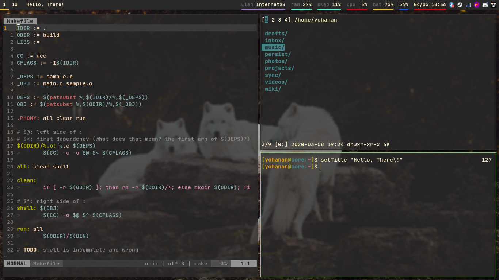

# YohananDiamond's Dotfiles



_Note: I rarely update this screenshot, so it might be completely
different right now._

This repository contains most of my config files and scripts.

## Installation

This repo is very unstable. I really recommend taking a look only at
files that interest you instead of simply copying everything because
not only it is very unsafe due to most scripts here being pretty
buggy, but also because I believe it's better to only add to your
system things that you understand, instead of making it confusing with
the imense amount of bloat that would come with getting all scripts
from a repository.

But if you want to do it anyway, you can do:

```bash
curl https://raw.githubusercontent.com/yohanandiamond/dotfiles/master/dots-install > dots-install.sh
sh dots-install.sh https path-to-dotfiles
```

It's still pretty buggy so remember to make your backups (and
possibly, run this in a VM) before doing anything.

## Folder structure

* `config`: config files, mostly symlinked to `~` and `~/.config`;

* `scripts`: executable files, added to PATH via `env.sh`;

* `lib`: some personal libraries for bash, python and other languages;

* `patches`: some patches I usually would like to apply on a system. I
  currently have no way to automate this.

* `trash`: old files that I don't want to delete right now, but aren't
  being used in the repo;

## Inspirations and "Steals"

The repos below are the ones from where I remember ~~stealing code~~
taking inspiration to make my dotfiles. There are lots of more people
from where I took inspiration - specially from r/unixporn and r/vim -
and I can't possibly remember them all, but I'd like to thank them. It
has been a pretty cool experience to make, well, pretty much my own
operating system, even though I didn't code the Linux kernel or
something.

* https://github.com/denysdovhan/dotfiles
* https://github.com/LukeSmithxyz/voidrice
* https://github.com/jdhao/nvim-config
* https://bitbucket.org/sjl/dotfiles/src/tip/vim/vimrc

## To Do

* [ ] Find a license to put here

* [ ] Add base16 support for NeoVim on Graphical Environments

* [ ] Add base16 support for NeoVim on Windows (without XResources)
